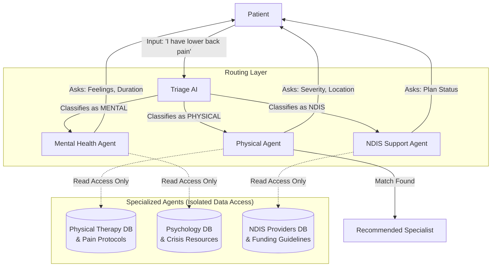

# Intelligent Multi-Agent Triage Architecture

This document outlines the architectural design for the **AI Health Assistant's** multi-agent system. The core design philosophy is **"Specialized Isolation"**, ensuring that agents only access data and logic relevant to their specific domain.

## 1. System Overview

We utilize a **Hub-and-Spoke** model where a central *Triage Agent* acts as the gatekeeper, analyzing user intent and routing them to a specialized *Domain Agent*.

### Database Architecture
While the system rests on a comprehensive database of health practitioners (Physiotherapists, Psychologists, Occupational Therapists, etc.), **no single agent scans the entire database concurrently.** This architecture enhances efficiency, privacy, and accuracy.

## 2. Agent Workflow

## 3. Agent Roles & Data Isolation

### Triage Agent (The Gatekeeper)
- **Role**: Purely linguistic analysis. It does *not* query practitioner data.
- **Task**: Analyzes the user's initial statement to determine the `DOMAIN`.
- **Output**: Activates *one* of the sub-agents.

### Physical Agent (Manual Therapy Specialist)
- **Trigger**: User mentions pain, injury, stiffness, or mobility issues.
- **Workflow**:
  1. **Inquiry**: Queries pain location, severity (1-5 Scale), and duration.
  2. **Data Scope**: Access is restricted to **Physiotherapists, Osteopaths, and Chiropractors**.
  3. **Logic**: Ignores mental health keywords; focuses on physical symptoms and functional limitations.

### Mental Health Agent (Emotional Support Specialist)
- **Trigger**: User mentions anxiety, stress, sadness, or burnout.
- **Workflow**:
  1. **Inquiry**: Queries qualitative feelings (e.g., Anxious, Sad) and identifying triggers.
  2. **Data Scope**: Access is restricted to **Clinical Psychologists, Counsellors, and Psychiatrists**.
  3. **Logic**: Prioritizes empathetic response patterns and crisis check protocols.

### NDIS Agent (Disability & Funding Specialist)
- **Trigger**: User mentions disability support, funding, or long-term care requirements.
- **Workflow**:
  1. **Inquiry**: Queries NDIS plan status (Managed/Self-Managed) and support goals.
  2. **Data Scope**: Access is restricted to **Occupational Therapists and NDIS-registered providers**.
  3. **Logic**: Focuses on capacity building, funding alignment, and provider eligibility.

## 4. Safety & Accuracy: Preventing Misguidance

A critical risk in AI health assistants is "Hallucination" (recommending an inappropriate specialist). This architecture strictly mitigates that risk through **Scope Limitation**.

### Prevention of Incorrect Recommendations
The `Physical Agent` is architecturally restricted from accessing the Mental Health database. This isolation prevents the system from recommending a Psychologist for a purely physical injury.

| Scenario | Standard AI (High Risk) | Multi-Agent System (Safe) |
| :--- | :--- | :--- |
| **Input**: "I feel a heavy weight on my chest." | Ambiguous interpretation: "Heart attack" vs "Anxiety". High probability of error. | **Triage Agent** detects "Anxiety" context -> Routes to **Mental Agent**. |
| **Agent Action** | Scans entire provider list. May select a Cardiologist based on keyword "chest". | **Mental Agent** ONLY scans Psychologists. It interprets "weight on chest" as a potential anxiety symptom within its domain. |
| **Inquiry** | Generic: "Does it hurt?" | Domain-Specific: "Are you feeling anxious right now?" (Excludes physical pain protocols). |
| **Outcome** | **Risk**: Referral to incorrect facility (ER) or specialist. | **Result**: Matches with a Psychologist specialized in Panic Disorders. |

## 5. Domain-Specific Questioning

Each agent operates within strict semantic boundaries ("blinders") to ensure focus. This maintains conversation relevance and efficiency.

- **Physical Agent Constraints**: Filters out emotive descriptors unrelated to pain intensity. Interprets "pain" strictly as a physical sensation (rated 0-10).
- **Mental Agent Constraints**: Filters out acute physical trauma terminology. Interprets "pain" as emotional distress.
- **NDIS Agent Constraints**: Excludes clinical diagnostic workflows. Focuses strictly on **administrative eligibility** and **support categories**.

### The "Funnel" Effect
By narrowing the focus immediately, we prevent irrelevant questioning:
- A user with a sprained ankle is **never** queried about their emotional state.
- A user with depression is **never** asked to rate physical pain on a numeric scale.

## 6. Strategic Benefits

1.  **Efficiency**: The "Physical Agent" does not consume resources scanning irrelevant datasets (e.g., Psychology records). It searches only the relevant subset of Physiotherapists.
2.  **Contextual Accuracy**: The "Mental Agent" interprets keywords like "pressure" as emotional stress, whereas the "Physical Agent" correctly interprets "pressure" as potential nerve compression.
3.  **Scalability**: New agents (e.g., a "Nutrition Agent") can be integrated as additional spokes without disrupting existing logic.
