 # Intelligent Multi-Agent Triage Workflow

This document outlines the architecture for the **AI Health Assistant's** multi-agent system. The core design philosophy is **"Specialized Isolation"**—ensuring that agents only access the data and logic relevant to their specific domain.

## 1. System Overview

We utilize a **Hub-and-Spoke** model where a central *Triage Agent* acts as the gatekeeper, analyzing user intent and routing them to a specialized *Domain Agent*.

### The "Big Database" Concept
While the system rests on a massive, comprehensive database of health practitioners (Physios, Psychologists, OTs, etc.), **no single agent scans the entire database at once.** This improves efficiency, privacy, and accuracy.

## 2. Agent Workflow

```mermaid
graph TD
    User[👤 Patient] -->|Input: 'I have lower back pain'| Triage[🧠 Triage AI]
    
    subgraph "Routing Layer"
    Triage -->|Classifies as PHYSICAL| PhysioAgent
    Triage -->|Classifies as MENTAL| PsychAgent
    Triage -->|Classifies as NDIS| NDISAgent
    end
    
    subgraph "Specialized Agents (Isolated Data Access)"
    
    PhysioAgent[🦴 Physical Agent]
    PsychAgent[🧠 Mental Health Agent]
    NDISAgent[♿ NDIS Support Agent]
    
    PhysioAgent -.->|Read Access Only| DB_Physio[(Physical Therapy DB\n& Pain Protocols)]
    PsychAgent -.->|Read Access Only| DB_Psych[(Psychology DB\n& Crisis Resources)]
    NDISAgent -.->|Read Access Only| DB_NDIS[(NDIS Providers DB\n& Funding Guidelines)]
    end
    
    PhysioAgent -->|Asks: Severity, Location| User
    PsychAgent -->|Asks: Feelings, Duration| User
    NDISAgent -->|Asks: Plan Status| User
    
    PhysioAgent -->|Match Found| Result[✅ Recommended Specialist]
```

## 3. Agent Roles & Data Isolation

### 🧠 Triage Agent (The Gatekeeper)
- **Role**: Purely linguistic analysis. It does *not* look at practitioner data.
- **Task**: Listens to the user's opening statement and determines the `DOMAIN`.
- **Output**: Activates *one* of the sub-agents.

### 🦴 Physical Agent (Manual Therapy Specialist)
- **Trigger**: User mentions pain, injury, stiffness, or mobility issues.
- **Workflow**:
  1. **Inquiry**: Asks about pain location, severity (1-5 Scale), and duration.
  2. **Data Slice**: access is restricted to **Physiotherapists, Osteopaths, and Chiropractors**.
  3. **Logic**: Ignores mental health keywords; focuses on physical symptoms.

### 🧠 Mental Health Agent (Emotional Support Specialist)
- **Trigger**: User mentions anxiety, stress, sadness, or burnout.
- **Workflow**:
  1. **Inquiry**: Asks for qualitative feelings (Chips: Anxious, Sad) and triggers.
  2. **Data Slice**: access is restricted to **Clinical Psychologists, Counsellors, and Psychiatrists**.
  3. **Logic**: Prioritizes empathy and crisis check protocols.

### ♿ NDIS Agent (Disability & Funding Specialist)
- **Trigger**: User mentions disability support, funding, or long-term care.
- **Workflow**:
  1. **Inquiry**: Asks about NDIS plan status (Managed/Self-Managed) and support goals.
  2. **Data Slice**: access is restricted to **Occupational Therapists and NDIS-registered providers**.
  3. **Logic**: Focuses on capacity building and funding alignment.

## 4. Safety & Accuracy: Preventing Misguidance

One of the biggest risks in AI health assistants is **"Hallucination"** (recommending the wrong type of doctor). This architecture strictly prevents that through **Scope Limitation**.

### How We Block Wrong Recommendations
Because the `Physical Agent` literally *cannot see* the Mental Health database, it is chemically impossible for it to recommend a Psychologist for a broken leg.

| Scenario | Standard AI (Risky) | Multi-Agent System (Safe) |
| :--- | :--- | :--- |
| **Input**: "I feel a heavy weight on my chest." | Might guess: "Heart attack" OR "Anxiety". Mixed probability. | **Triage Agent** detects "Anxiety" context -> Routes to **Mental Agent**. |
| **Agent Action** | Scans all doctors. Might pick a Cardiologist due to keyword "chest". | **Mental Agent** ONLY scans Psychologists. It knows "weight on chest" = panic attack symptom in its domain. |
| **Inquiry** | Generic: "Does it hurt?" | Domain-Specific: "Are you feeling anxious right now?" (Ignores physical pain protocols). |
| **Outcome** | **Risk**: Sends user to ER (costly) or wrong specialist. | **Result**: Matches with a Psychologist specialized in Panic Disorders. |

## 5. Domain-Specific Questioning (The "Blinkered" Approach)

Each agent wears "blinders" that force it to focus ONLY on its specialty. This keeps the conversation short and relevant.

- **Physical Agent Blinders**: It ignores words like "sad", "hopeless", or "funding". It interprets "pain" strictly as a physical sensation (0-10 scale).
- **Mental Agent Blinders**: It ignores words like "fracture" or "swelling". It interprets "pain" as emotional distress.
- **NDIS Agent Blinders**: It ignores clinical symptoms entirely. It focuses purely on **administrative eligibility** and **support categories**.

### The "Funnel" Effect
By narrowing the focus immediately, we prevent the user from being bombarded with 20 irrelevant questions.
- A user with a sprained ankle is **never** asked "How is your mood?"
- A user with depression is **never** asked "Rate your pain from 1-5."

## 6. Benefit of This Approach

1.  **Efficiency**: The "Physical Agent" never wastes resources scanning 5,000 psychologists. It only searches the 500 physiotherapists.
2.  **Contextual Accuracy**: The "Mental Agent" knows that "pressure" usually means emotional stress, whereas the "Physical Agent" knows "pressure" might mean nerve compression.
3.  **Scalability**: We can add a "Nutrition Agent" later without breaking the existing logic—just add a new spoke to the hub.
